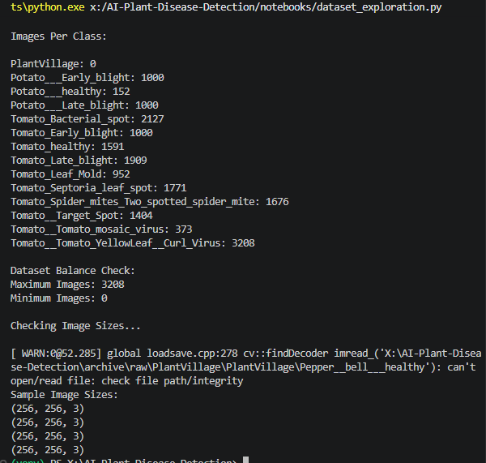
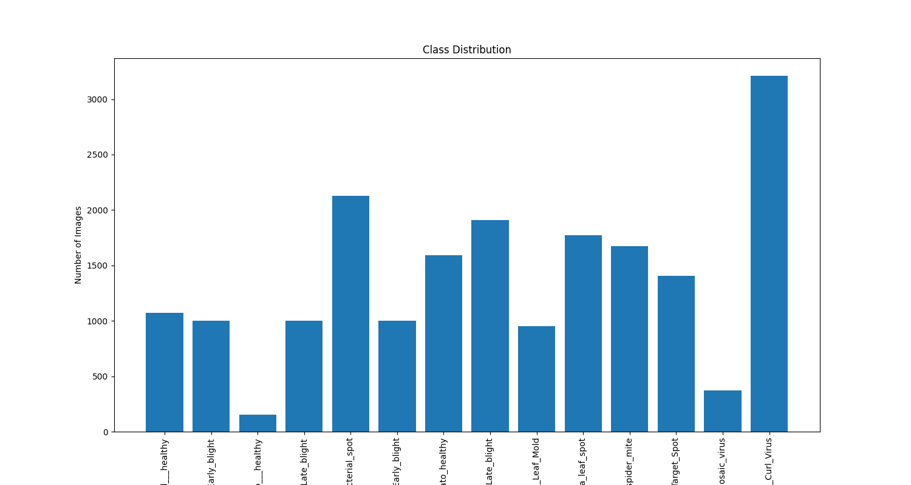
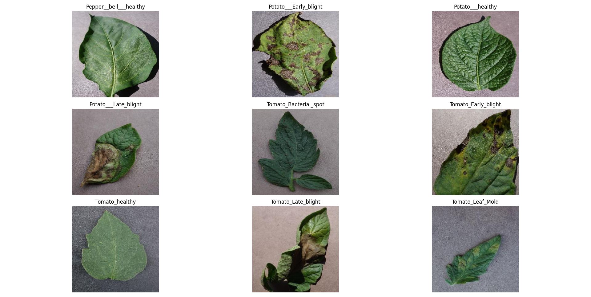
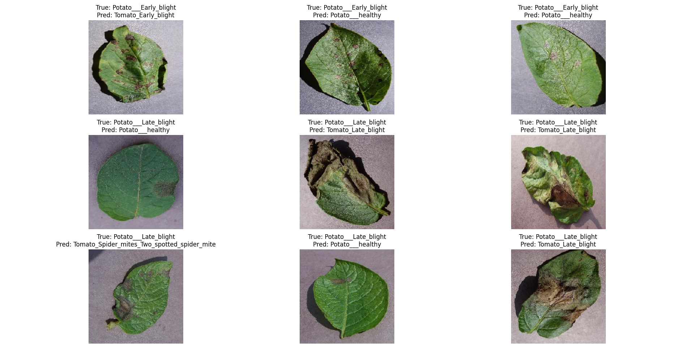

# AI Plant Disease Detection

A deep learning project for detecting plant diseases from leaf images using image classification.

The project uses the PlantVillage dataset and compares a custom CNN model with transfer learning using MobileNetV2. A Streamlit application is included to allow users to upload a leaf image and view the model's prediction.

## What This Project Does

The model takes an image of a plant leaf and predicts its corresponding class.

The project includes:

* CNN-based image classification
* Transfer learning using MobileNetV2
* Image preprocessing and augmentation
* Model evaluation using multiple metrics
* Testing with real-world leaf images
* Confidence score for predictions
* Unknown image detection
* Batch image prediction
* Streamlit web application

## Dataset

The project uses the **PlantVillage dataset**.

The classes used in this project include:

* Tomato diseases
* Potato diseases
* Pepper healthy leaves

The dataset contains healthy and diseased leaf images used for training and evaluation.

## Models

### Custom CNN

A CNN model was developed as a baseline for the classification task.

### MobileNetV2 Transfer Learning

MobileNetV2 was used as a pretrained model and fine-tuned for plant disease classification.

The transfer learning approach achieved better performance than the baseline CNN and was selected as the final model.

## Project Workflow

```text
PlantVillage Dataset
        ↓
Data Exploration
        ↓
Image Preprocessing
        ↓
Data Augmentation
        ↓
CNN Baseline
        ↓
MobileNetV2 Transfer Learning
        ↓
Model Evaluation
        ↓
Real-World Testing
        ↓
Streamlit Application
```

## Model Performance

The final model achieved a test accuracy of:

**90.52%**

The model was evaluated using:

* Accuracy
* Precision
* Recall
* F1-Score
* Confusion Matrix
* ROC Curve

## Real-World Testing

The model was tested with different types of images to understand its performance outside the original dataset.

Testing included:

* Real leaf images
* Low-light images
* Blurry images
* Images with complex backgrounds

An unknown-detection threshold was also added to reduce incorrect predictions for images that do not belong to the expected classes.

## Streamlit Application

A Streamlit application is included for testing the trained model through a simple web interface.

The application allows users to:

1. Upload a plant leaf image
2. Process the image
3. Run the trained model
4. View the predicted class
5. View the confidence score
6. Get a suggested remedy where available

## Technologies Used

* Python
* TensorFlow
* Keras
* OpenCV
* NumPy
* Pandas
* Scikit-learn
* Matplotlib
* Streamlit

## Project Structure

```text
AI-Plant-Disease-Detection/
│
├── archive/
│   └── raw/
│       └── PlantVillage/
│
├── data/
│   └── processed/
│
├── models/
│   └── transfer_learning/
│
├── notebooks/
│
├── reports/
│
├── screenshots/
│
├── src/
│
├── streamlit_app/
│
├── README.md
├── requirements.txt
└── .gitignore
```

## Screenshots

### Dataset Exploration



### Class Distribution



### Sample Leaf Images



### Model Evaluation


### Training Loss


### Test Accuracy


### ROC Curve


### Prediction Result



## Running the Project

Clone the repository:

```bash
git clone https://github.com/Lucky5683/ai-plant-disease-detection.git
cd ai-plant-disease-detection
```

Install the required packages:

```bash
pip install -r requirements.txt
```

Run the Streamlit application:

```bash
streamlit run streamlit_app/app.py
```

## Project Purpose

The purpose of this project was to understand how computer vision and deep learning can be applied to image classification.

Through this project, I worked with image preprocessing, CNNs, transfer learning, model evaluation, real-world testing, and deployment using Streamlit.

## Author

**Dinesh Kumar**

B.Tech in Computer Science Engineering
Specialization: Artificial Intelligence & Data Science

GitHub: [https://github.com/Lucky5683](https://github.com/Lucky5683)
